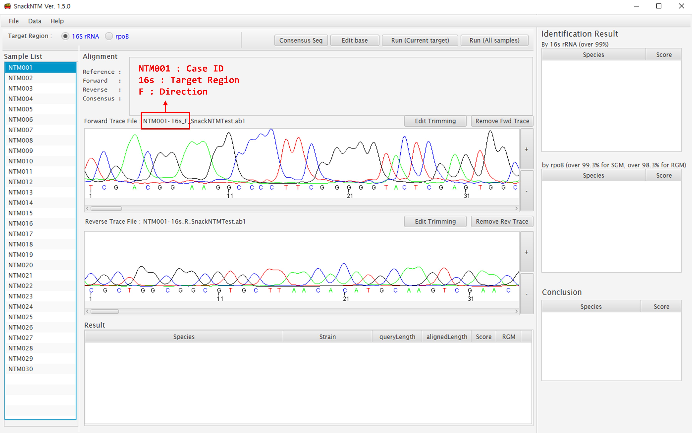

SnackNTM Ver 1.5.1
======================
SnackNTM is a free software for Nontuberculous mycobacteria(NTM) identification. 

# 1. How to Run
1. You need to have [Java](https://www.java.com) installed.(Version 8 or higher)
2. Download SnackNTM Ver1.5.1 and unzip. (Download : Release tab above)
3. Run  
Windows : Run.bat or SnackNTM.jar (If not run by double click, right click-> open with -> JAVA) 
Linux, Mac : java -jar SnackNTM.jar

# 2. How to Use
[**You can download and watch SnackNTM_Demo.mp4**](SnackNTM_Demo.mp4)

Using SnackNTM is quite straightforward. 

1. Click new project from menu 

2. Open trace files (choose all trace files at once) 

3. Trace filesa are allocated according to the file naming rules 

4. Identification results are shown after clicking 'Run all samples' button 

# 4. Utilized Libraries
BioJAVA Legacy  (https://github.com/biojava/biojava-legacy) 
Apache POI 3.15 (https://github.com/apache/poi)

# 5. Reference sequences
[Reference sequences](references)
